#**Vehicle Detection** 

###Project description

The goals of this project are to identify cars in images and video frames and draw a bounding box around them. This is an important task for self-driving cars, as they need to know where the other drivers are in order to create an appropriate driving policy.

A classic computer vision approach for solving this problem is to extract features corresponding to cars manually from each image. To do so, a combination of techniques like histogram of oriented gradients (HOG), color transform with binned color features and histograms of HOG feature vectors could be used.

Those techniques include a lot of parameters, that need to be chosen by hand. For example, for the HOG feature exctraction, those parameters are: orientations, pixels per cell and cells per block. As I learned, choosing all of them manually can be a lot of pain! Under different lighting conditions, shadows, etc., they tend to perform poorly. Thats why I decided to use a deep learning approach to avoid the manual feature extraction in this project.

A fully-convolutional network is used to avoid the sliding window approach. The big advantage is, that it can be trained without any bounding boxes as labels, just the two car / non-car categories. 
Heatmaps are used to combine those windows, and then finally bounding boxes are calculated and displayed for every detected car.

Check out the final video here:

---

###Vehicle detection

In the first step, the dataset is explored. It is comprised of images taken from the GTI vehicle image database, the KITTI vision benchmark suite, and examples extracted from the project video itself. There are two classes, cars and non-cars. The cars have a label of 1.0, whereas the non-cars have a label of 0.0:

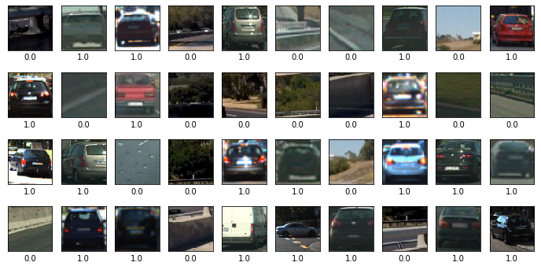

There is a total number of 17760 samples available, each image is colored and has a resolution of 64x64 pixels. The dataset is split into the training set (90%, 15984 samples) and validation set (10%, 1776 samples). The distribution shows, that the dataset is very balanced, which is important for training the neural network later. Otherwise, it would have a bias towards one of the two classes. The distribution looks like this:

A neural network is used as deep-learning approach, to decide which image is a car and which is a no-car. The fully-convolutional network looks like this:

After training for 20 epochs, we can use this model to make a prediction on a random sample:

Next, we feed a full 1280 x 720 test image into our network:

The nice thing is that we can use the same network we trained with our 64x64 images to detect cars everywhere in the frame. This is because there are no fully-connected neurons at the end, just convolutional layer with max pooling and dropout. They scale to whatever the input is, so now we do not have a one-neuron output, but something like a heatmap. We can then draw bounding boxes on the hot positions:

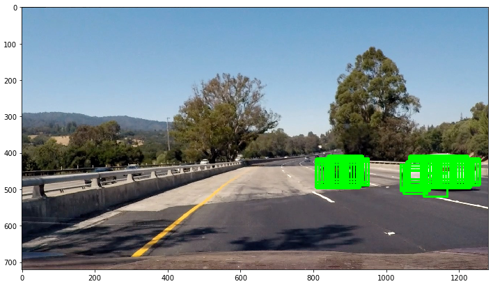

There may be some false positives, so we create a heatmap and a little threshold to it. Then we draw one bounding box for every detected heat source:

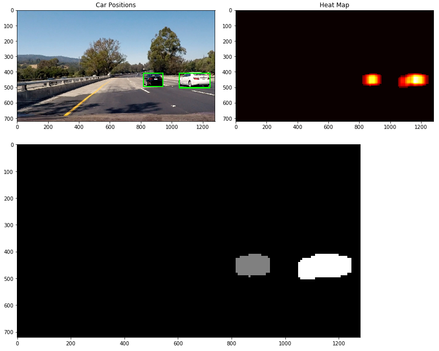

---

###Lane detection

In this section I will explain, how I detected the two lane lines on the road for each frame using computer vision techniques.

This is the test image we will be using:

At first we apply a region-of-interest mask to remove everything except for the interesting section:

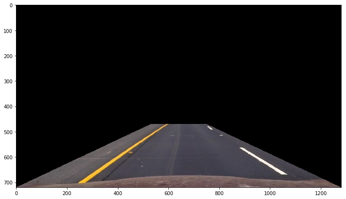

Then we apply a perspective transformation to better detect the lanes:

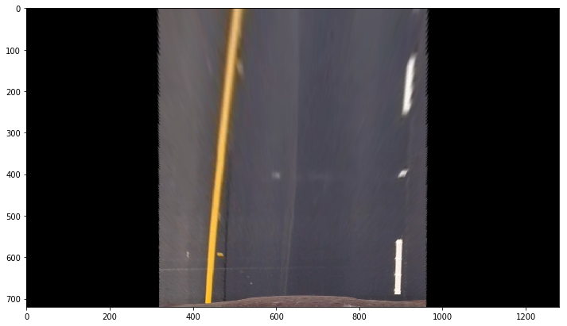

In the next step, a HSV color mask is applied to detect the white and yellow lanes:

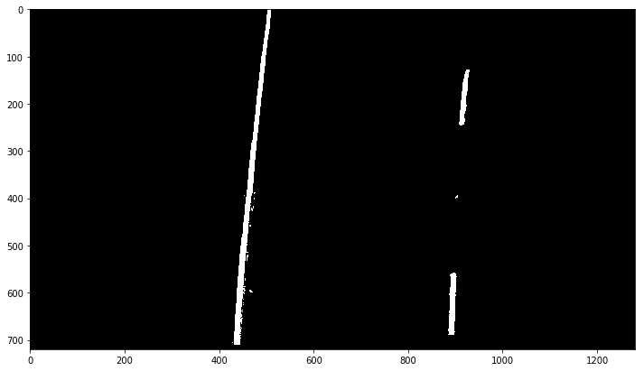

A sobel filter is utilized to detect edges:

Afterwards, those two masks are combined:

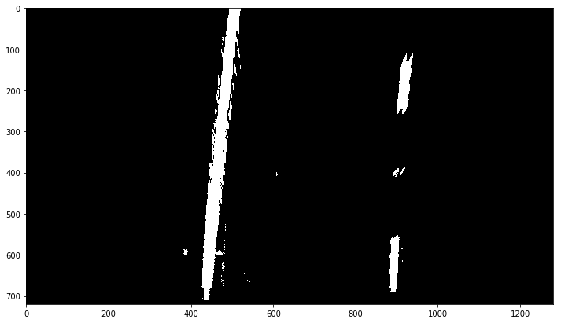

A histogram is used to search for the starting points of the lanes on the bottom:

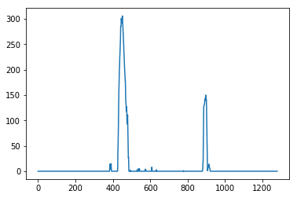

Those are handed over to a sliding window, which tracks the lanes to the top and creates a function approximation:

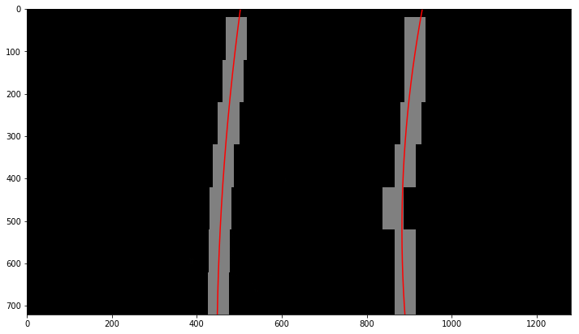

Finally, the functions are transformed back to our images and the area between the lanes is marked in blue:

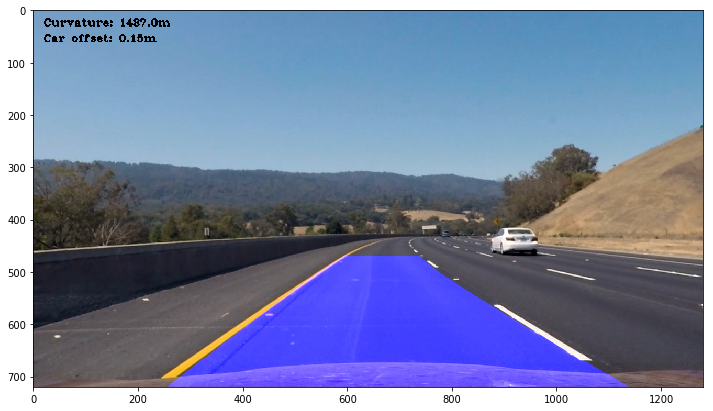

---

###Discussion

The detection results of the neural network are actually very good, there are no false positives in both the test images and the project video. This shows that the network has learned to detect cars with a very good accuracy, although the base of the VGG16 model has only been trained on the ImageNet dataset in general.

The drawback is the long processing time due to the large number of 318 sliding windows per frame. Therefore, it takes up to 30 seconds for the prediction of one complete / image on a CPU only, which is a very long time. The processing of the full project video took 9h and 20 minutes, which shows that the sliding window approach is not suitable for a large neural network like this.

There are a lot other fast approaches for the use of neural networks on the task of object detection. In 2014, the ["R-CNN"](https://arxiv.org/abs/1311.2524) was first announced, which adds region proposals to a CNN. R-CNN creates these bounding boxes, or region proposals, using a process called Selective Search. At a high level, Selective Search looks at the image through windows of different sizes, and for each size tries to group together adjacent pixels by texture, color, or intensity to identify objects. 

To speed up and simplify R-CNNs, in 2015 a technique called ["Fast R-CNN"](https://arxiv.org/abs/1504.08083) was introduced. One year later, the region proposal was speeded up even further with ["Faster R-CNN"](https://arxiv.org/abs/1506.01497). The newest development from 2017 is ["Mask R-CNN"](https://arxiv.org/abs/1703.06870), which extends R-CNN for pixel level segmentation. Interesting approaches are also ["SqueezeDet"](https://arxiv.org/abs/1612.01051), a ["SqueezeNet"](https://arxiv.org/abs/1602.07360) adaptation for object detection in the field of autonomous driving and the ["YOLO9000"](https://arxiv.org/abs/1612.08242) object detection network, which is really fast and delivers astonishing results:

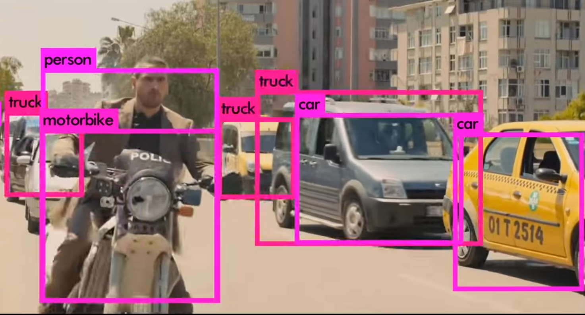